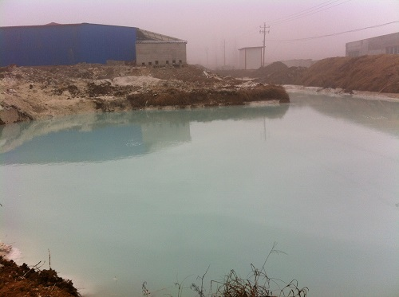
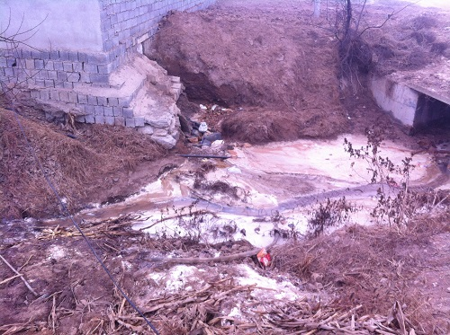

# 峨山工业园环境污染问题

2015年寒假，赵丰和刘涛、张宇三人为完成毛概课社会实践的作业，前往峨山工业园
进行调研。

赵丰在报告中写道：

我们主要在工业园至附近村庄（黄庄） 镇任楼村小区至附近农户蔬菜大棚转悠了一圈。

在工业园，我们先进入了一家大理石厂，正值过年，厂里只有一个看门的老大爷和一条凶恶的藏獒，不断地朝我们狂吠，刘涛很有观察力地问大爷厂里堆的一袋袋是什么原料，机警的大爷此时装聋作哑，我们也很识趣地退离此地。

但我们在各厂的外部见到了几个“人工湖”，大概是要处理的废水积聚成的废水池。大都泛绿蓝色，走近了还有一股异味。可能废水处理地并不达标。

在黄庄，我们与一家农户攀谈起工业园的情况，她们也直说工业园对其生活有很大的负面影响。“厂子多是外地的老板，员工也多是外地人，工厂的发展成果基本与我们这些普通老百姓无关。”我们又问了用水的情况，“上了年纪的老人一般只能吃机井的水，肯定被污染过了，粮食也同样；年轻人还知道去超市买米买面，也能用得起自来水。”关于土地占用的补偿情况，她们说是按年给补偿金。尽管废水废气对他们村特别是靠近工厂的部分造成了很大影响，但她们也承认这里没有上访的，估计镇政府也不会听取他们的诉求。

刘涛在报告中写道：“在峨山，面对当地政府操作并不透明的上马项目，村民们不闻不问；工厂建设占用农业用地，除了每年相应的补偿之外并没有给村民带来任何收益，村民们却表现得事不关己；工厂已经对当地土地、水体造成污染，并已危害到村民健康，他们忍气吞声；面对政府部门对他们权益的忽视和不作为，他们自吞黄连••••••”

相关录音：

1. [投诉无门](https://freiwilliger.oss-cn-shenzhen.aliyuncs.com/volunteer/environment_pollution_2015/cut1.mp3)
1. [废水问题](https://freiwilliger.oss-cn-shenzhen.aliyuncs.com/volunteer/environment_pollution_2015/cut2.mp3)
1. [小孩含铅量超标](https://freiwilliger.oss-cn-shenzhen.aliyuncs.com/volunteer/environment_pollution_2015/cut3.mp3)

相关照片：

